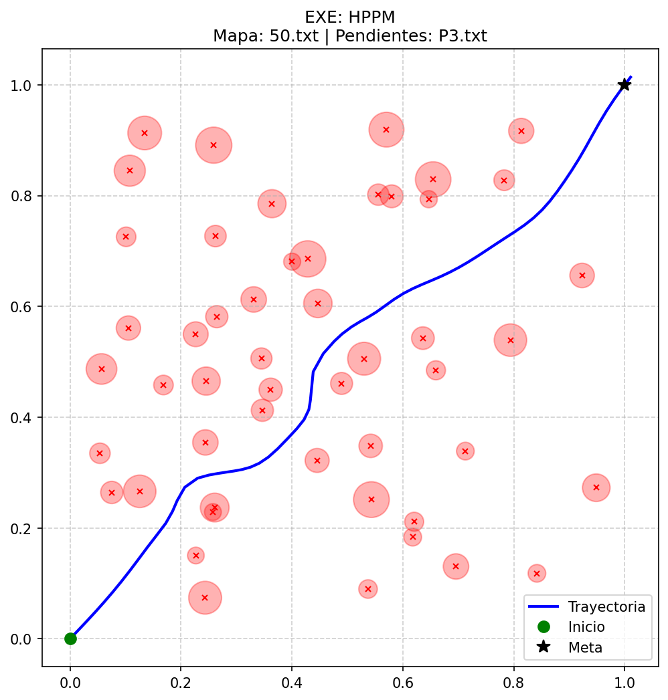
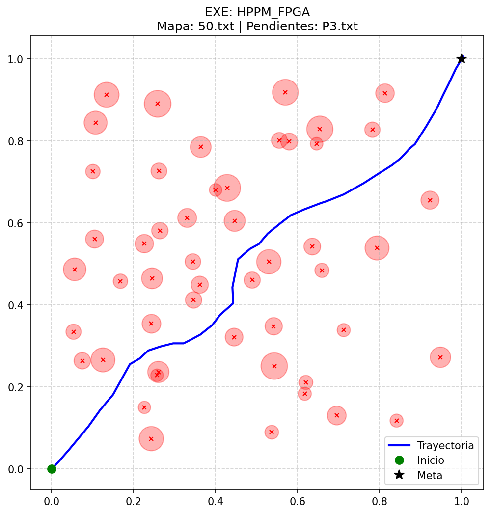
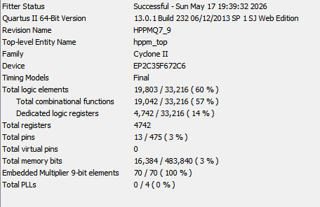

# Homotopic Path Planning for Robotics (HPPM)
### Optimized Hardware and Software Co-design

Hello! Welcome to this repository. This project solves a classic robotics problem: navigating a robot safely through a field of obstacles. 

The coolest part about this system is how it bridges software and hardware. We use the Homotopic Path Planning Method (HPPM) and a Newton-Raphson algorithm to calculate safe routes. We first test everything in software using standard math. Then, we translate that math into a highly optimized fixed-point hardware design that runs lightning-fast on an FPGA.

## Project Structure

I organized the code into three main sections to keep things clear.

### 1. Simulation Tools (The `HPPM` Folder)
This folder is your testing ground. It contains the software models to validate the algorithms before touching the hardware.
* `HPPM.c`: The baseline mathematical model. It uses standard floating-point numbers. It calculates the "perfect" route.
* `HPPM_FPGA.c`: The exact hardware twin. It uses fixed-point arithmetic (Q7.9 format) and custom mathematical clamps. It simulates exactly what the physical chip will do.
* `CorrerTodo.py`: A Python automation script. It runs both C programs, compares them against different obstacle maps, and automatically draws the trajectory images.

### 2. Hardware Architecture (Verilog RTL)
These files describe the digital circuits. They are custom-built to save resources and run efficiently on boards like the Altera Cyclone II.
* **Master Control**: `hppm_top.v` and `hppm_core.v`. These files manage the main state machine and coordinate all sub-modules.
* **Repulsive Calculation**: `repulsive_acc.v`. This module calculates how obstacles push the robot away. It includes a mathematical wall to prevent dividing by zero during collisions.
* **Linear Algebra**: `newton_step.v` and `jacob_assembler.v`. They build and solve a 3x3 matrix. We added a dynamic row scaler here to prevent bit overflows without wasting extra hardware.
* **Communication and Memory**: `uart_rx.v`, `uart_tx.v`, and `dual_port_ram.v`. They handle PC communication and store the obstacle coordinates.

### 3. MATLAB Control Interface
We included a MATLAB script to manage the physical hardware. You can use it to read obstacle maps, send them to the FPGA via the serial port, and plot the real-time path the chip calculates.

---

## Simulation Results

Here is a side-by-side look at how the software and hardware algorithms handle a complex map with 50 obstacles. 

**Standard Floating-Point Model (`HPPM.c`)** This shows the smooth baseline trajectory using infinite decimal precision.

**Fixed-Point Hardware Model (`HPPM_FPGA.c`)** This shows the exact hardware behavior using 16-bit math. Notice how it successfully reaches the goal while keeping the math incredibly lightweight.

---

## ⚙️ Hardware Implementation and Performance

We synthesized and routed this design specifically for the **Altera Cyclone II (EP2C35F672C6)** using Quartus II. 

The goal was to maximize math capabilities without overflowing the logic elements. By keeping the main buses at 16 bits and using smart pre-shifting techniques, we achieved a highly efficient fit.

**Performance:**
* **Operating Frequency (Fmax):** 56.18 MHz

**Resource Usage:**
* **Total Logic Elements:** 19,803 / 33,216 (60%)
* **Dedicated Logic Registers:** 4,742 (14%)
* **Total Memory Bits:** 16,384 / 483,840 (3%)
* **Embedded Multipliers (9-bit):** 70 / 70 (100%)

*Note: We purposefully utilized 100% of the embedded multipliers to accelerate the 3x3 matrix inversions, while keeping the logic elements usage at a comfortable 60%.*

---

## How to Run It

### Testing the PC Simulations
1. Open the `HPPM` folder.
2. Ensure you have your input text files ready (`pendientes.txt` and `obstaculos1.txt`).
3. Compile both `HPPM.c` and `HPPM_FPGA.c` using GCC.
4. Run the `CorrerTodo.py` script to automatically test the maps and generate the output images.

### Running the Physical FPGA
1. Open Quartus II and create a new project for your Cyclone II board.
2. Add all the `.v` files to the project.
3. Assign the physical pins for the clock, the reset button, and the UART Rx/Tx lines.
4. Compile the project and program the FPGA.
5. Open the MATLAB script, set your COM port, and run it. The board will calculate the trajectory and send it back to your screen instantly.
